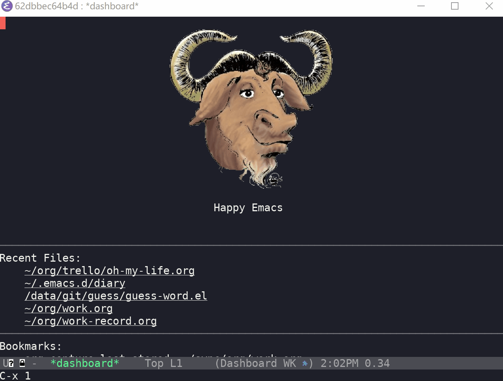

# 规则

给出单词释义，另外将答案糢糊化，写出正确的单词即可。

# using

> M-: (guess-word)

## keybinding

* `<return>` 检查输入是否正确
* `C-r` 切换词库
* `C-<return>` 如果输入正确选择下一个单词，如果当前输入错误将会展示正确答案
* `M-x guess-word-add-dictionary-path` 添加自定义字典
* `M-x guess-word-delete-dictionary-path` 删除某一个词典

## 词库

* 四级词汇
* 六级词汇
* 托福核心

Thanks https://github.com/mahavivo/english-wordlists
