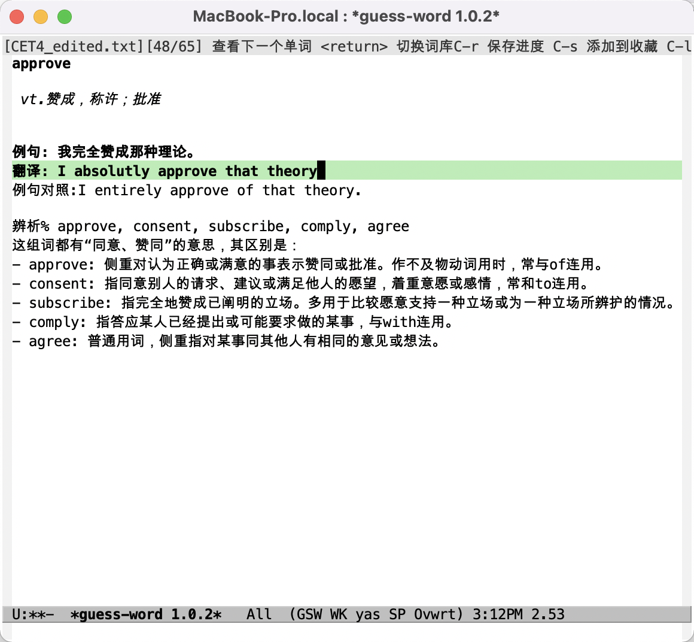
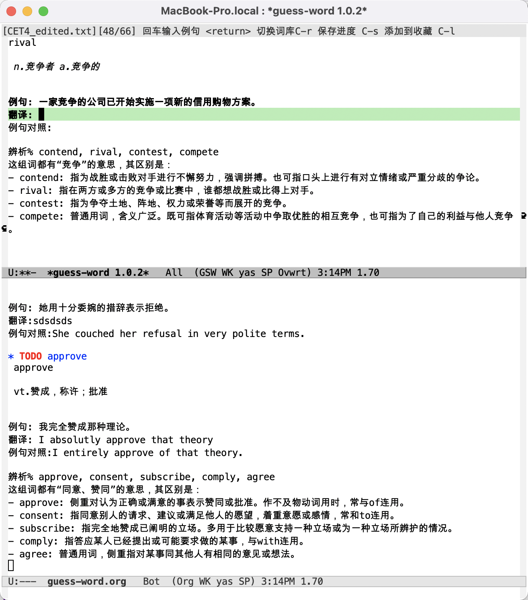

# 规则

1. 给出单词释义，另外将答案糢糊化，写出正确的单词即可。
2. 提供了同义词辨析，方便同向对比相同意思的词。
3. 增加了造句的步骤，不作为计分依据，仅仅与标准例句做对比。
4. 增加收藏功能，一键将单词、辨析、例句收藏到org文件中，可以方便手动与org-drill等卡片工具结合使用。

软件截图

例句功能演示

收藏功能演示

# using

> M-: (guess-word)

## keybinding

* `<return>` 检查输入是否正确, 如果错误情况下，清除所有输入，再按下 `<return>` 会显示正确答案
* `C-r` 切换词库
* `C-s` 保存当前计分数据 (未来可能会废弃)
* `C-l` 将当前界面输入内容保存至org文件中
* `M-x guess-word-add-dictionary-path` 添加自定义字典
* `M-x guess-word-delete-dictionary-path` 删除某一个词典

## 配置

默认org文件会存放在当前项目目录，如果想更改可以配置

`(setq guess-word-org-file (f-expand "~/org/my-esl.org"))`

## 词库

* 四级词汇
* 六级词汇
* 托福核心

Thanks https://github.com/mahavivo/english-wordlists 提供了词典库
Thanks https://github.com/skywind3000/ECDICT 提供了同义词辨析库

## 例句

例句生成脚本在 node.js 中，如果添加新的词库需要重新生成下例句。(默认例句包含了CET4, CET6, TOEFL，7748条，已经足够全了，所以也可以不重新生成)。

例句使用的是从海词句海网站抓取(juhai.dict.cn)
